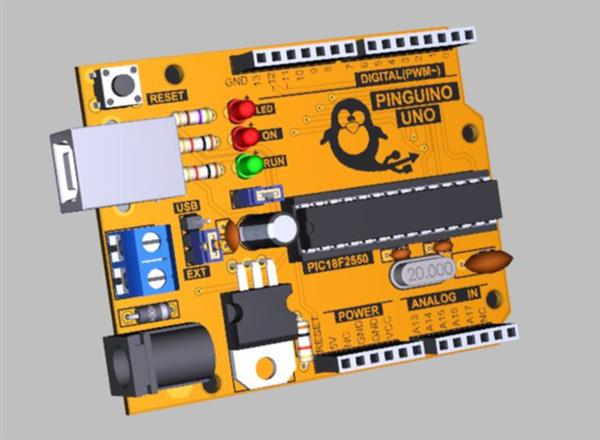
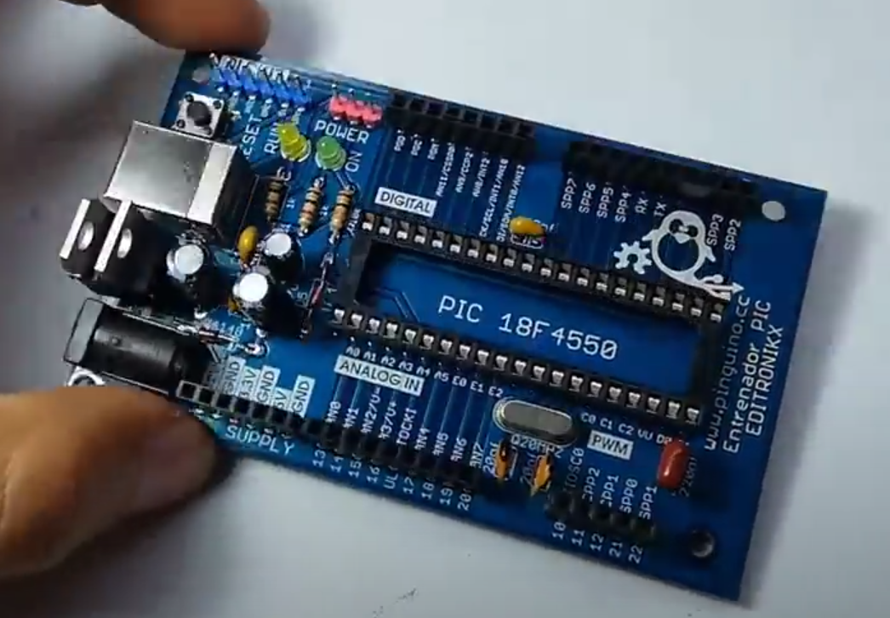
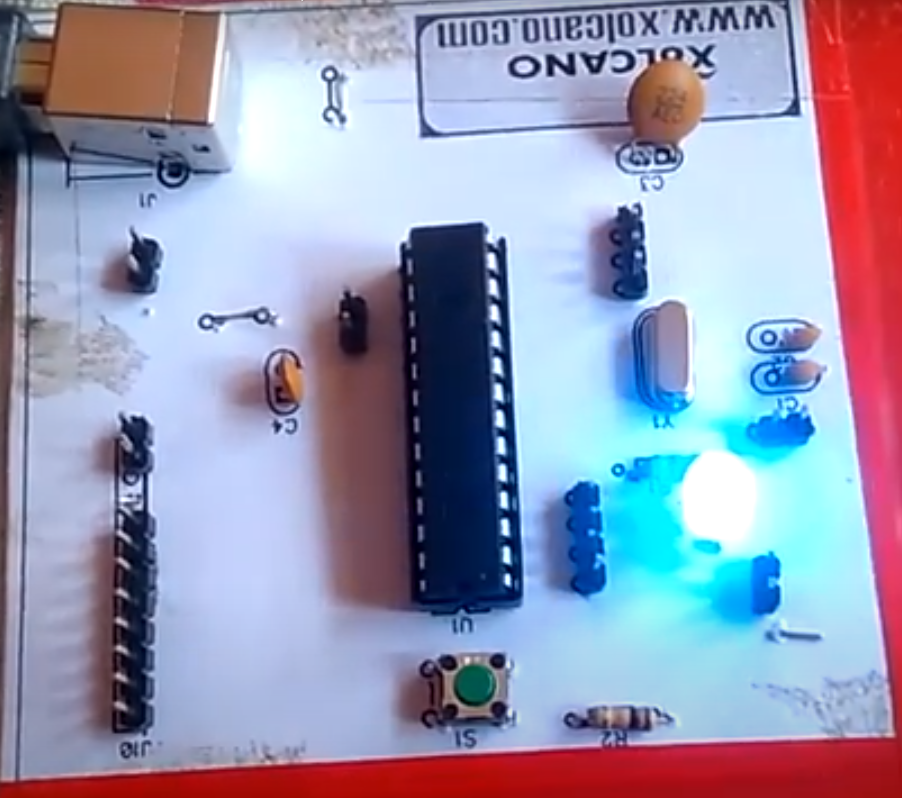

# Do-It-Yourself

::: tip
This section is for build a board your self. If what you want is **to buy a board**, please go to the 
[/pinguino-boards/buy](/pinguino-boards/buy) page.
:::

[[toc]]

Pinguino Project is [Open Hardware](https://en.wikipedia.org/wiki/Open-source_hardware). This means
that the user has access to all the necessary technical information that allows him to
design and / or build his own Pinguino board.

Even more: The design of Pinguino is so simple that the boards can be built in breadboard,
perforated plates, or single-faced Pertinax, at home. And if you have the resources, you can send
the Gerber files to suppliers like [PCBWay](https://www.pcbway.com/) or [JLCPCB](https://jlcpcb.com/)
for a professional finish, at U$D 2-5 for 5 pieces.

## How to build a board ?

Follow these simple steps:

1. **Board design**
  * Design the board yourself. You can find basic diagrams on the [8-bit supported boards](/pinguino-boards/supported-boards-8) page.
  * Or choice one of the following diagrams bellow.

2. **Board manufacturing**
  * Make the board yourself.
  * Or send the Gerber files to a manufacturer.

3. **Board firmware**
  * Burn the Pinguino firmware on the chip.
  * Or buy a microcontroller with the firmware already inside.

4. Enjoy

## 8-bit Board designs

Some Pinguino Board designs by the Community...

### Pinguino 26J50 Tiny

| Based on:	| PIC18F26J50	|
|:--------------|:--------------|
| Author:	| Regis Blanchot	|
| Web:		| [Github](https://github.com/PinguinoIDE/pinguino-cad/tree/master/boards/26J50)|
| Designed with:	| KiCAD |

### Pinguino 45K50

| Based on:	| PIC18F45K50	|
|:--------------|:--------------|
| Author:	| Regis Blanchot	|
| Web:		| [Github](https://github.com/PinguinoIDE/pinguino-cad/tree/master/boards/45K50)|
| Designed with:	| KiCAD |

### Pinguino 47J53

| Based on:	| PIC18F47J53A	|
|:--------------|:--------------|
| Author:	| Regis Blanchot |
| Web:		| [Github](https://github.com/PinguinoIDE/pinguino-cad/tree/master/boards/47J53)|
| Designed with:	| KiCAD |

### Pinguino 2550 v2

| Based on:	| PIC18F2550	|
|:--------------|:--------------|
| Author:	| Victor Villarreal |
| Web:		| [Github](https://github.com/MefhigosetH/pinguino-boards)|
| Designed with:	| KiCAD |

### Pinguino Uno

| Based on:	| PIC18F2550	|
|:--------------|:--------------|
| Author:	| PCBDesigner	|
| Web:		| [PCBWay](https://www.pcbway.com/project/shareproject/Pinguino_UNO___Pic18F2550.html)|
| YouTube:	| [YouTube](https://www.youtube.com/watch?v=EoYsf2O1QBQ)|
| Designed with:	| Altium Designer |

### Pinguino Uno 2550

| Based on:	| PIC18F2550	|
|:--------------|:--------------|
| Author:	| PCBDesigner	|
| Web:		| [PCBWay](https://www.pcbway.com/project/shareproject/PINGUINO_UNO_PIC18F2550.html)|
| YouTube:	| [YouTube](https://www.youtube.com/watch?v=3PlAXMARl_o)|
| Designed with:	| Altium Designer |

### Pinguino 4550

| Based on:	| PIC18F4550	|
|:--------------|:--------------|
| Author:	| PCBDesigner	|
| Web:		| [PCBWay](https://www.pcbway.com/project/shareproject/Pinguino_PIC18F4550.html)|
| YouTube:	| [YouTube](https://www.youtube.com/watch?v=EuCuwwoP3R0)|
| Designed with:	| Altium Designer |

### Editronikx 4550

| Based on:	| PIC18F4550	|
|:--------------|:--------------|
| Author:	| [Editronikx](https://www.editronikx.com.co/2019/01/tarjeta-pinguino-entrenate-programando.html)	|
| Web:		| [PCBWay](https://www.pcbway.com/project/shareproject/pinguino_4550_editronikx_2018_12_15.html)|
| YouTube:	| [YouTube](https://www.youtube.com/watch?v=sWOqW9E5mBA)|

### Do-It-Yourself 4550

| Based on:	| PIC18F4550	|
|:--------------|:--------------|
| Author:	| MicroControllerElectronics Blog	|
| Web:		| [Blog](https://microcontrollerelectronics.com/do-it-yourself-pinguino-pic18f4550-board/)|

### Xolcano Pinguino

| Based on:	| PIC18F2550	|
|:--------------|:--------------|
| Author:	| [Xolcano](https://xolcano.com/)	|
| Web:		| [Instructables](https://www.instructables.com/Pinguino-Project-a-PIC-Microcontroller-Based-Ardui/)|

## 32-bit Board designs

Some Pinguino 32-bits Board designs by the Community...

### Pinguino 32MX250

| Based on:	| PIC32MX250	|
|:--------------|:--------------|
| Author:	| Regis Blanchot	|
| Web:		| [Github](https://github.com/PinguinoIDE/pinguino-cad/tree/master/boards/32MX250)|
| Designed with:	| KiCAD |

