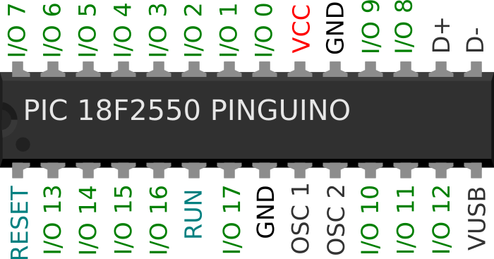
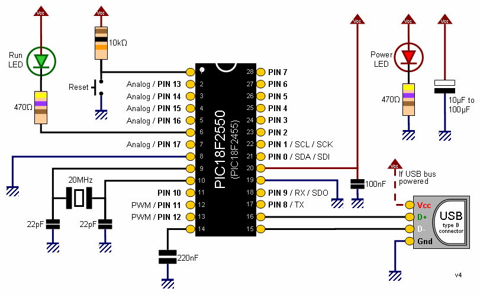
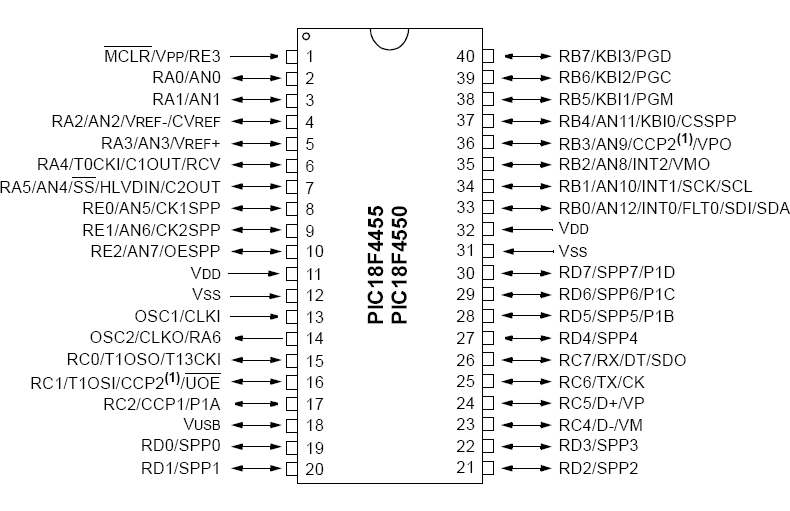
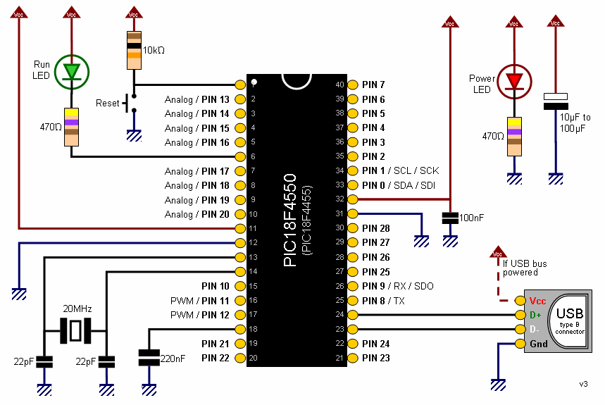

# 8-bit Supported Boards

This is the list of the 8-bit boards that's supported by the current v13 of Pinguino IDE:

| Board name      |
|-----------------|
| Pinguino 13K50  |
| Pinguino 14K50  |
| Pinguino 25K50  |
| Pinguino 26J50  |
| Pinguino 27J53  |
| Pinguino 45K50  |
| Pinguino 46J50  |
| Pinguino 47J53A |
| Pinguino 1459   |
| Pinguino 2455   |
| Pinguino 2550   |
| Pinguino 4455   |
| Pinguino 4550   |
| Pinguino Torda  |
| CHRP3.0         |
| Curiosity 1708  |
| Amicus 18       |
| FreeJALduino    |
| PIC Uno Equo    |

## 18F2550

Ideal for low power (nanoWatt) and connectivity applications that benefit from the availability
of three serial ports: FS-USB (12 Mbit/s), I²C™ and SPI™ (up to 10Mbit/s) and an asynchronous
(LIN capable) serial port (EUSART).

Large amounts of RAM memory for buffering and Enhanced FLASH
program memory make it ideal for embedded control and monitoring applications that require periodic
connection with a (legacy free) Personal Computer via USB for data upload/download and/or
firmware updates.

### Pinout

### Basic Diagram

## 18F4550

### Pinout

### Basic Diagram

