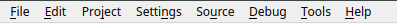
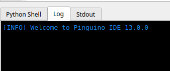
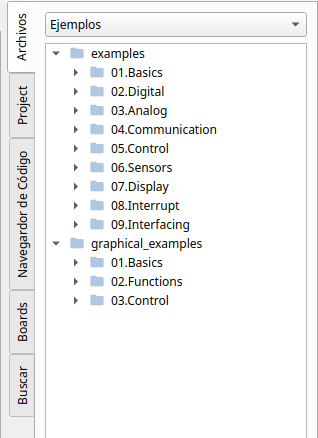

# Manual do Usuário da IDE

A janela principal do Ambiente de Desenvolvimento Integrado do Pinguino *ou Pinguino IDE* contém
um editor de texto para escrever código, um console do shell do Python, um console de log, uma janela stdout,
uma barra de ferramentas com botões para funções comuns, uma barra lateral, uma barra de status e uma série de menus.
Ela conecta a uma placa Pinguino para carregar programas e se comunicar com ela.

## Menu

Comandos adicionais são encontrados nos oito menus: Arquivo, Editar, Projeto, Ajustes, Fonte,
Debug, Ferramentas, Ajuda.

## Barra de Ferramentas

Os botões da barra de ferramentas permitem criar novo9s arquivos, criar novo arquivo de bloco, abrir arquivos,
salvar o arquivo atual, desfazer a última ação, refazer, recortar o código selecionado, copiar, colar, pesquisar,
selecionar a placa Pinguino correta, compilar e carregar seu código para a placa, e salvar a imagem compilada;
nessa ordem.

## Editor de Texto

Os programas são escritos na área do editor de texto editor e são salvos com a extensão `*.pde`.
O editor tem os seguintes recursos:

* Cortar/copiar/colar texto.
* Pesquisar/substituir texto.
* Desfazer/refazer ações.
* Comentar/descomentar regiões.
* Indentar/Desindentar.
* Gerenciar um ou mais arquivos simultaneamente através de abas.

The text editor also have autocomplete capabilities, syntax highlighting and program line numbers.

## Log console

The message log area gives feedback while compile and upload code to the board,
and also displays errors.

## Side bar

Sidebar is divided into five main tabs: Files, Project, Code browser, Boards, and Search.

## Status bar

The status bar provides information about the board type, programming mode and compiler
currently selected in the IDE.

